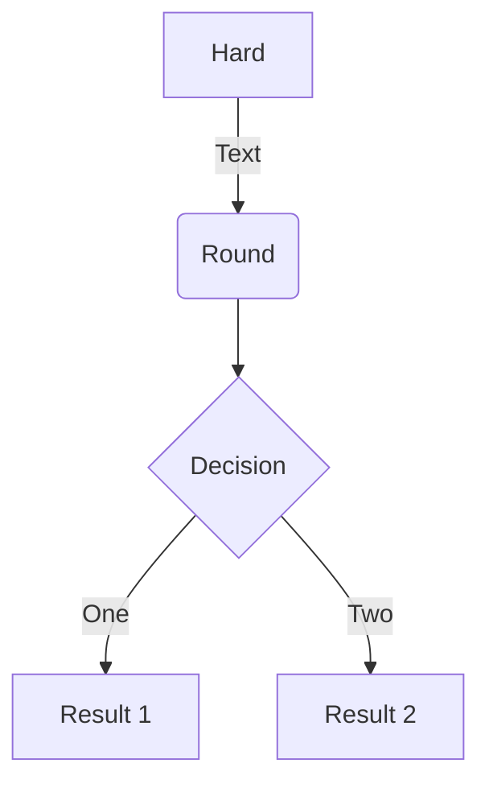

# Homepage

Learning about mkdocs

## Guide

Essentials:

- [repo mkdocs-material](https://github.com/squidfunk/mkdocs-material)
- [mkdocstrings](https://github.com/mkdocstrings/mkdocstrings)
- [mkdocs jupyter](https://github.com/danielfrg/mkdocs-jupyter)
- [mkdocs pages](https://github.com/mkdocs/mkdocs/wiki/MkDocs-Plugins#navigation--page-building)

## Project layout

    documentacao_mkdocs
        docs/
            docs/
                index.md  # The documentation homepage.
                ...       # Other markdown pages, images and other files.
        site/
            ...
        mkdocs.yml


## Textos

### Lista de tarefas

- [ ] Documentar
- [x] Pesquisar

### Formatações

==realce==

**negrito**

_itálico_

[comment]: <> (Bloco de códigos com highlight e numeração)
## Bloco de Código

```{.py3 hl_lines="1 3" linenums="1" title="Cool header"}
def xpto():
    """Testing docs"""
    return False
```

[comment]: <> (Criando diagramas)
## Diagramas

